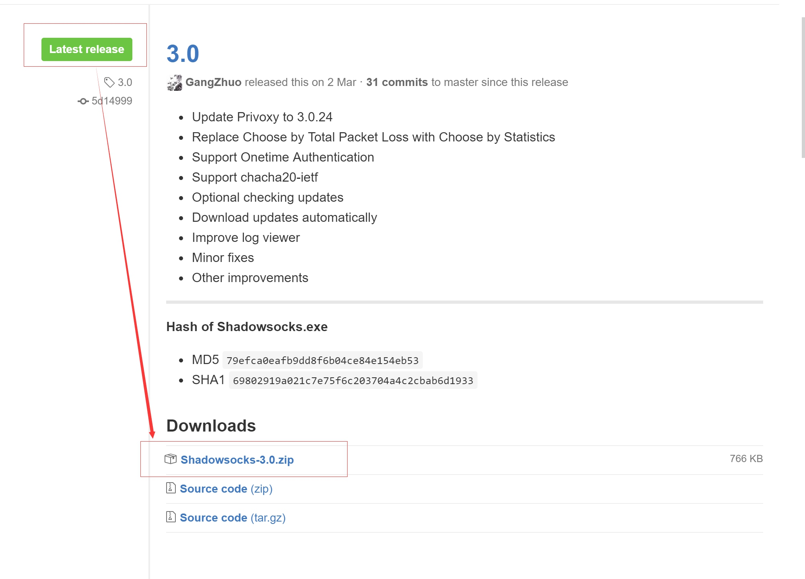
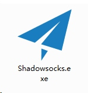
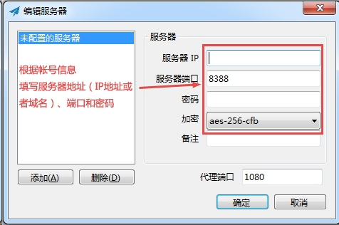
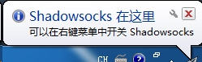
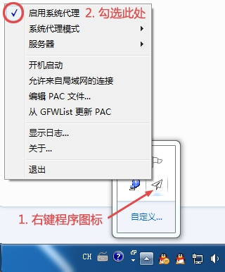

# Shadowsocks(小飞机)

## Shadowsocks 是什么
Shadowsocks 是一种安全的 socks5 代理，可以保护你的上网流量。基于多种加密方式，推荐使用 aes-256-cfb 加密。安装和使用需要本地端和服务端。本地客户端已经包含了多种版本，包括iOS，Android，Windows，MAC，甚至是路由器 (基于OpenWRT)，所以使用方便，各取所需。远程服务端则一般安装在基于 Linux 的各种发行版操作系统，比如 Debian， CentOS， Fedora， Redhat， Ubuntu， openSUSE等。

## Shadowsocks 的作者是谁
最初只有 Python 版，由 @clowwindy 开发和维护，后来随着知名度提高，开始出现各种语言的版本，其中比较知名的是 libev ， go， nodejs 等版本，需要注意的是，nodejs 的作者也是 @clowwindy，但最近已不再维护该版本。libev 的维护者是@madeye，长期更新。

- - - - -

## **[`官方客户端`](https://github.com/shadowsocks/shadowsocks-windows/releases)**

## [第三方客户端:shadowsocksR](https://github.com/breakwa11/shadowsocks-rss)

## 免费Shadowsocks账号获取地址

- [ishadowsocks](http://www.ishadowsocks.net/)
- [freeshadowsocks](https://freessr.xyz/)

## 使用方法

> [Shadowsocks使用指导](https://www.dou-bi.co/ss-jc26/)

1. 解压到任意目录，运行其中的Shadowsocks.exe

    

2. 首次运行，会弹出编辑服务器窗口，按图示填写您的Shadowsocks服务器地址、端口、密码和加密方式

    

    点确定后，会如下提示

    

3. 按提示右键程序图标，弹出菜单，勾选“启用系统代理”

    

