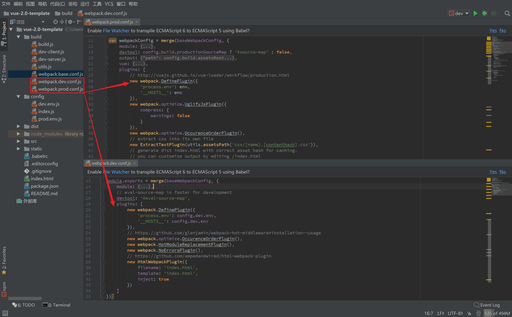

# 使用webpack生成不同发布环境的api地址
> webpack 官方提供了一个 definePlugin，专门用来定义一些变量，通常我们把用于类似开发和生产环境的切换上。
> [https://webpack.github.io/docs/list-of-plugins.html#defineplugin](https://webpack.github.io/docs/list-of-plugins.html#defineplugin)

Example:
```js
new webpack.DefinePlugin({
    PRODUCTION: JSON.stringify(true),
    VERSION: JSON.stringify("5fa3b9"),
    BROWSER_SUPPORTS_HTML5: true,
    TWO: "1+1",
    "typeof window": JSON.stringify("object")
})
```
```js
console.log("Running App version " + VERSION);

if(!BROWSER_SUPPORTS_HTML5) 
    require("html5shiv");

if (!PRODUCTION)
    console.log('Debug info')
if (PRODUCTION)
    console.log('Production log')
```

vue-cli生成的项目中在`build/webpack.dev.conf.js`和`build/webpack.prod.conf.js`文件下的`plugins`节点

