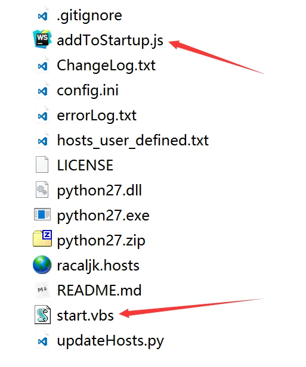

# Hosts

> Hosts不是长久有效的，如发现访问不了则需更新最新的Hosts。
> Hosts更新后打开浏览器访问[https://www.google.com/ncr](https://www.google.com/ncr),刚替换完有可能还是无法访问，此时需要清除缓存多刷新几次。

### 怎样修改Hosts

- **Windows** : 打开资源管理器定位到C:\windows\system32\drivers\etc\ 找到hosts文件，获得读写权限，用记事本打开并修改。

- **Mac OS X** : 右键点击Dock上的Finder，选择［前往文件夹］，输入/etc回车，找到hosts文件，拖到桌面，在桌面修改完成，删掉/etc里面的hosts（需要密码鉴定），然后把桌面的hosts拖回去（需要鉴定）。

  > 在Mac下修改可能需要您的管理员权限批准。
  > 

- **Linux** : 定位到/etc，取得hosts读写权限，然后修改保存。

### hosts 获取地址

- [YouTube、Google+、Facebook、Twitter、维基百科最全hosts](https://blog.netsh.org/posts/youtube-google-facebook-twitter-wikipedia-hosts_1199.netsh.html)
- [racaljk.hosts](https://raw.githubusercontent.com/racaljk/hosts/master/hosts)

### [hosts 自动更新程序](https://github.com/ladder1984/updateHosts)

> 每次手动替换失效hosts比较麻烦，也可以使用下面的自动更新脚本进行修改，但是hosts文件一定要有读写权限

[Update Hosts 下载](https://github.com/MrLeo/highsheng/raw/master/updateHosts.zip)  : *使用的hosts源是`racaljk.hosts`可替换，替换方法请移步[官网](https://github.com/ladder1984/updateHosts)*

- 使用的时候只需要 **双击** `start.vbs` 文件即可完成自动更新。

- 如果想让 hosts 始终保持最新，可以 **双击** `addToStartup.js` 将此脚本加入到启动项，开机状态下每隔1小时会自动获取一次

  ​
  
