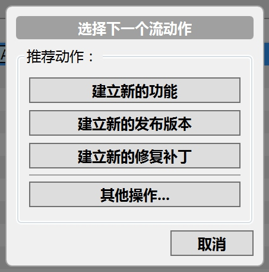
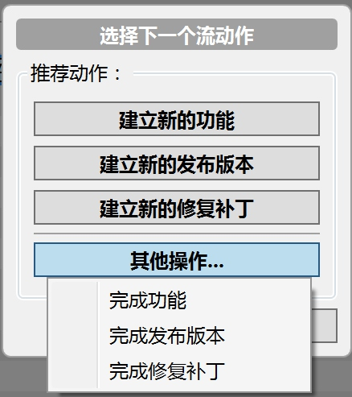

# 客户端
- [GitHub for windows](https://windows.github.com/)
- [SourceTree ](https://www.sourcetreeapp.com/)
***
# Git操作
- [用SourceTree轻巧Git项目图解](http://www.cnblogs.com/simadi/p/5072480.html)
- [Git教程 - 廖雪峰的官方网站](http://www.liaoxuefeng.com/wiki/0013739516305929606dd18361248578c67b8067c8c017b000)
- [猴子都能懂的GIT入门](http://backlogtool.com/git-guide/cn/)
- [Git起步](https://git-scm.com/book/zh/v1/%E8%B5%B7%E6%AD%A5)
- [版本控制入门 – 搬进 Github](http://www.imooc.com/learn/390)
- [写给Git初学者的7个建议](http://blog.jobbole.com/50603/)

> *[程序员提交代码的 emoji 指南](http://www.toutiao.com/i6353472144239755777/?tt_from=weixin&utm_campaign=client_share&app=news_article&utm_source=weixin&iid=6177424078&utm_medium=toutiao_ios&wxshare_count=1)*

***
# Git工作流

- **[feature](https://segmentfault.com/a/1190000002918123#articleHeader13)**`功能分支`（多个、玫红）。主要是自己玩了，差不多的时候要合并回develop去。从不与master交互。
- **develop**`开发主分支`（1个、黄色）。主要是和feature以及release交互。
- **[release](https://segmentfault.com/a/1190000002918123#articleHeader14)**`发布分支`（同一时间1个、绿色）。总是基于develop，最后又合并回develop。当然对应的tag跑到master这边去了。生命周期很短，只是为了发布
- **[hotfix](https://segmentfault.com/a/1190000002918123#articleHeader15)**`线上维护分支`（同一时间1个、红色）。总是基于master，并最后合并到master和develop。生命周期较短，用了修复bug或小粒度修改发布。
- **[master](https://segmentfault.com/a/1190000002918123#articleHeader12)**`正式发布历史分支`（1个蓝色）。没有什么东西，仅是一些关联的tag，因从不在master上开发。

> SourceTree中的Git工作流
> 
> 
> 

***

# 参考:
- Git分支管理策略[^1]
- 企业级开发：Gitflow Workflow工作流[^2]
- Git工作流指南：Gitflow工作流[^3]
- 深入理解学习Git工作流（git-workflow-tutorial）[^4]

***

[^1]: <http://www.ruanyifeng.com/blog/2012/07/git.html> "Git分支管理策略"
[^2]: <http://www.jianshu.com/p/104fa8b15d1e> "企业级开发：Gitflow Workflow工作流"
[^3]: <http://blog.jobbole.com/76867> "Git工作流指南：Gitflow工作流"
[^4]: <https://segmentfault.com/a/1190000002918123> "深入理解学习Git工作流（git-workflow-tutorial）"
